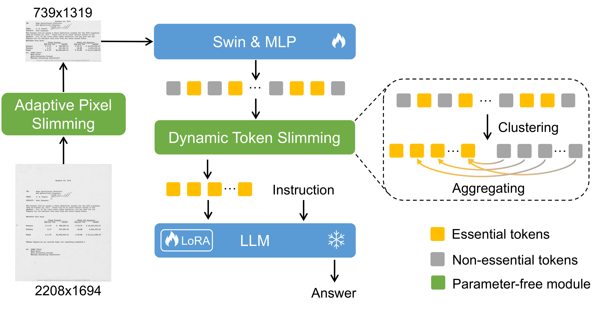

<div align=center>

# DocKylin: A Large Multimodal Model for Visual Document Understanding with Efficient Visual Slimming
</div>

A reimplementation of the key modules APS and DTS in [DocKylin](https://arxiv.org/abs/2406.19101). Due to company policy restrictions, the original DocKylin code cannot be open-sourced. This reimplementation is provided here and may have slight differences.


<p align="center">
  
</p>


## Adaptive Pixel Slimming (APS)
```bash
python aps.py --im_path 'demo/' --resize --visualize
```
- `--resize`: Use this to resize the image back to its original dimensions after applying APS. For MLLMs with image resolutions exceeding the maximum resolution supported by the model, it can be set to False. However, for MLLMs that support high resolutions, it should be set to True to obtain performance improvements.
- `--visualize`: Use this to save some intermediate results.

Some results when applying APS to existing MLLMs

|Methods|Supported Resolution|DocVQA|InfoVQA|SROIE|FUNSD|
|-|-|-|-|-|-|
|LLaVA1.5|224x224|8.5|14.7|1.7|0.2|
|LLaVA1.5+APS|224x224|10.7 (+27.4%)|14.7 (+0%)|3.7 (+118%)|0.9 (+360%)|
|QwenVL|448x448|48.1|23.9|34.5|20.6|
|QwenVL+APS|448x448|51.2 (+6.4%)|24.7 (+4.1%)|40.0 (+15.9%)|24.3 (+17.9%)|
|Monkey|896x896|50.1|25.8|41.9|24.1|
|Monkey+APS|896x896|56.3 (+12.4%)|27.5 (+6.6%)|47.0 (+12.2%)|27.3 (+13.3%)|
|InternVL2|448x448x(1~12)|76.2|49.5|54.7|41.7|
|InternVL2+APS|448x448x(1~12)|76.1|48.2|54.2|40.6|
|InternVL2+APS+Resize|448x448x(1~12)|77.3 (+1.4%)|49.4 (-0.2%)|55.2 (+0.9%)|43.4 (+4.1%)|


## Dynamic Token Slimming (DTS)
DTS needs to be applied to a trained image encoder and linear projection layer, so no corresponding demo is provided here. Please refer to the code and the associated comments for customized usage.


## Citation
If you are using our code and data, please consider citing our paper.
```
@inproceedings{zhang2024dockylin, 
Author = {Zhang, Jiaxin and Yang, Wentao and Lai, Songxuan and Xie, Zecheng and Jin, Lianwen}, 
Booktitle = {Proceedings of the AAAI conference on artificial intelligence}, 
Title = {Dockylin: A large multimodal model for visual document understanding with efficient visual slimming}, 
Year = {2025}}   
```


## ⭐ Star Rising
[](https://star-history.com/#ZZZHANG-jx/DocKylin&Timeline)


Some codes are based on [TextMonkey](https://github.com/Yuliang-Liu/Monkey) and [TPS](https://github.com/megvii-research/TPS-CVPR2023). Thanks to all the authors for their great work.
